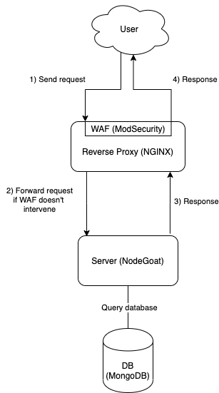
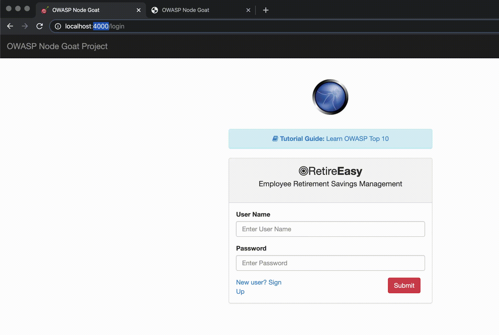

# NGINX reverse proxy with ModSecurity WAF

In this project we've built a NGINX server with a [Web Application Firewall (WAF)](https://en.wikipedia.org/wiki/Web_application_firewall) to filter and forward requests to [NodeGoat](https://github.com/OWASP/NodeGoat).

<p align="center">
  
</p>

This repository contains a Dockerfile for NGINX using ModSecurity as a dynamic module. In the `conf` folder you can find the configuration for NGINX and ModSecurity. NodeGoat is a vulnerable web server that will be protected under the NGINX reverse proxy, this way we can be sure that the WAF works. 

For the ModSecurity configuration we use the [OWASP ModSecurity Core Rule Set](https://github.com/SpiderLabs/owasp-modsecurity-crs) to include a few rules so the WAF can (try to) prevent common attacks such as cross-site scripting.

After starting the servers with `docker-compose`, you can access the application via NGINX on port 80. You can also go to port 4000 to go directly to the application without going through NGINX, this way you can check that the vulnerabilities are there.

<p align="center">
  
</p>


## Glossary

This section is meant to the people that found this repository and want to know more. The goal is to present a few definitions and links so you don't have to "google" them if you are interested in the topic.


### OWASP
> The Open Web Application Security Project (OWASP) is a nonprofit foundation that works to improve the security of software


Source: https://owasp.org/


### OWASP Top 10
> The OWASP Top 10 is a regularly-updated report outlining security concerns for web application security, focusing on the 10 most critical risks. The report is put together by a team of security experts from all over the world


Source: https://www.cloudflare.com/learning/security/threats/owasp-top-10/


### Proxy
> A proxy server is a go‑between or __intermediary server that forwards requests for content__ from multiple clients to different servers across the Internet


Source: https://www.nginx.com/resources/glossary/reverse-proxy-server/


### Reverse proxy 
> A reverse proxy server is a type of proxy server that typically sits behind the firewall in a private network and __directs client requests to the appropriate backend server__. A reverse proxy provides an additional level of abstraction and control to ensure the smooth flow of network traffic between clients and servers.


Source: https://www.nginx.com/resources/glossary/reverse-proxy-server/


### NGINX
> nginx [engine x] is an HTTP and reverse proxy server, a mail proxy server, and a generic TCP/UDP proxy server, originally written by Igor Sysoev.


Source: https://nginx.org/en/


### Firewall
> A firewall is a security system that monitors and controls network traffic based on a set of security rules. Firewalls usually sit between a trusted network and an untrusted network; oftentimes the untrusted network is the Internet


Source: https://www.cloudflare.com/learning/security/what-is-a-firewall/


### Web Application Firewall
> A WAF or Web Application Firewall helps protect web applications by filtering and monitoring HTTP traffic between a web application and the Internet. It typically protects web applications from attacks such as cross-site forgery, cross-site-scripting (XSS), file inclusion, and SQL injection, among others.


Source: https://www.cloudflare.com/learning/ddos/glossary/web-application-firewall-waf/

Note: WAFs work on application level. Thanks to this, WAFs can inspect HTTP packets and look for strings that look like SQL injections for example.


### ModSecurity
> ModSecurity is an open source, cross platform web application firewall (WAF) engine for Apache, IIS and Nginx


Source: https://github.com/SpiderLabs/ModSecurity


### Docker
> Docker is a software platform that allows you to build, test, and deploy applications quickly. __Docker packages software into standardized units called containers that have everything the software needs to run__ including libraries, system tools, code, and runtime. Using Docker, you can quickly deploy and scale applications into any environment and know your code will run


Source: https://aws.amazon.com/docker/


## Clone this repository

```
git clone --recurse-submodules https://github.com/carlosdg/NginxProxyWithModsecurity.git
```


## Run the project

```
docker-compose up
```


## References

- [How to implement ModSecurity WAF with NGINX](https://medium.com/building-goalwise/how-to-implement-modsecurity-waf-with-nginx-15fdd42fa3)
- [Compiling NGINX module as dynamic module for use in docker](https://gist.github.com/hermanbanken/96f0ff298c162a522ddbba44cad31081)
- [NGINX Beginner’s Guide](https://nginx.org/en/docs/beginners_guide.html)